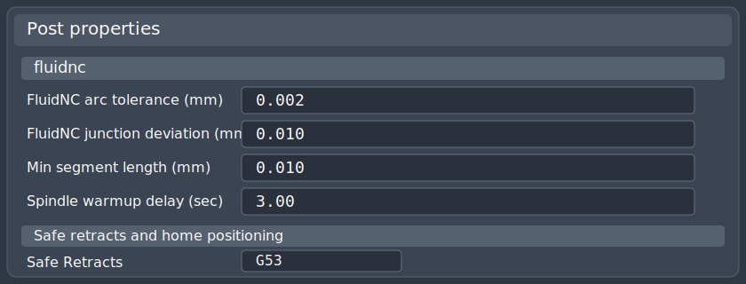

# FluidNC Post Processor For Fusion

This repository ships a Fusion post processor tuned for FluidNC-based CNC machines.

## Distribution Status

This repository and the `v1.0.1` GitHub release currently publish `FluidNC.cps` publicly.

The Autodesk-derived redistribution status of the Fusion adapter is still unverified. If upstream rights require a change, future releases may move to patch-based packaging and the current adapter artifact may need to be taken down or replaced.

The shipped adapter is a repository-authored rewrite with a repo-owned helper contract. It does not preserve the imported Autodesk helper/property surface in the active `FluidNC.cps`; old-post comparison and compatibility work live in the local mock-harness tooling instead. Upstream provenance in `adapters/fusion/upstream/` is metadata-only and does not include a tracked upstream `.cps` working copy.

If you only want the post, start with:

- [FluidNC.cps](adapters/fusion/FluidNC.cps)
- [Install In Fusion](docs/install-fusion.md)

If you want the advanced repo workflow with a Linked Folder, use the install guide above. If you just want a local post file, copy `FluidNC.cps` into your Fusion posts folder and select it in Fusion's Post dialog.



## What Is Different From Stock GRBL

This post adds FluidNC-focused behavior and properties that are not in the stock Fusion GRBL post flow:

- FluidNC-specific post properties for arc tolerance, junction deviation, minimum segment length, and spindle warmup delay
- planner-aware minimum segment filtering to reduce very short linear moves
- split-file output for `No splitting`, `Split by tool`, and `Split by toolpath`
- safer operation restarts and split-file restarts with `G53` machine retracts
- `safeStartAllOperations` support that still works on controllers without optional block support
- inch jobs keep `G20` across section starts instead of falling back to metric
- emitted headers echo the FluidNC arc tolerance, junction deviation, and segment filter values used for the post

## Default FluidNC Behavior In This Post

- `Flood`: disabled on purpose and emits no coolant-on code
- `Mist`: mapped to `M7` on and `M9` off
- `Air`: mapped to `M8` on and `M9` off
- `Use coolant`: when disabled in Fusion, suppresses all coolant output
- `Safe retracts`: defaults to `G53`
- `Spindle warmup delay`: defaults to `3` seconds
- `FluidNC arc tolerance`: defaults to `0.002 mm`
- `FluidNC junction deviation`: defaults to `0.01 mm`
- `Min segment length`: defaults to `0.05 mm` in code, but can be changed per post run

## Recommended Fusion Settings

In the Post dialog:

- set `FluidNC arc tolerance (mm)` to match your FluidNC `arc_tolerance_mm`
- use `Safe Retracts = G53`
- keep `Use feed per revolution (G95)` disabled
- keep `Use coolant` enabled if you want `Mist` or `Air` commands to output
- set `Min segment length (mm)` to `0` if you want no filtering, `0.05` for a conservative filter, or `0.1` for a stronger filter

## Install In Fusion

### Simple local install

1. Download [FluidNC.cps](adapters/fusion/FluidNC.cps).
2. In Fusion, open the Post Library.
3. Import the file into `My Posts`, or copy it to your local posts folder.
4. Select `FluidNC` when posting.

Typical local post path on Windows:

`C:\Users\<you>\AppData\Roaming\Autodesk\Fusion 360 CAM\Posts\FluidNC.cps`

### Linked-folder install

If you want the repo copy to be your live Fusion post, follow:

- [Install In Fusion](docs/install-fusion.md)

## Coolant Mapping Changes You Can Make Locally

Edit one of these:

- your repo copy: `adapters/fusion/FluidNC.cps`
- your local Fusion copy: `C:\Users\<you>\AppData\Roaming\Autodesk\Fusion 360 CAM\Posts\FluidNC.cps`

After editing, save the file and restart Fusion or refresh the Post Library.

### Example: make Flood output `M8` and `M9`

Change this code:

```javascript
coolants: [
  {id:COOLANT_FLOOD}, // intentionally no on/off codes - machine has no flood coolant hardware
  {id:COOLANT_MIST, on:7, off:9},
  {id:COOLANT_THROUGH_TOOL},
  {id:COOLANT_AIR, on:8, off:9},
  {id:COOLANT_AIR_THROUGH_TOOL},
  {id:COOLANT_SUCTION},
  {id:COOLANT_FLOOD_MIST},
  {id:COOLANT_FLOOD_THROUGH_TOOL},
  {id:COOLANT_OFF, off:9}
],
```

To this code:

```javascript
coolants: [
  {id:COOLANT_FLOOD, on:8, off:9},
  {id:COOLANT_MIST, on:7, off:9},
  {id:COOLANT_THROUGH_TOOL},
  {id:COOLANT_AIR, on:8, off:9},
  {id:COOLANT_AIR_THROUGH_TOOL},
  {id:COOLANT_SUCTION},
  {id:COOLANT_FLOOD_MIST},
  {id:COOLANT_FLOOD_THROUGH_TOOL},
  {id:COOLANT_OFF, off:9}
],
```

### Example: swap Air and Mist

Change this code:

```javascript
{id:COOLANT_MIST, on:7, off:9},
{id:COOLANT_AIR, on:8, off:9},
```

To this code:

```javascript
{id:COOLANT_MIST, on:8, off:9},
{id:COOLANT_AIR, on:7, off:9},
```

### Example: disable all coolant output without editing code

In Fusion's Post dialog:

- leave your tool coolant set however you want
- set `Use coolant` to off

That suppresses all coolant commands from the post.

## What Has Been Validated

The current post has captured regression fixtures for:

- inch jobs
- multi-tool jobs
- split-file jobs
- dense micro-segment jobs

These are stored under [fixtures/expected/fusion](fixtures/expected/fusion) and checked by:

- [Test-FixtureCaptures.ps1](tools/validate/Test-FixtureCaptures.ps1)

## Next Steps

The next major expansion is tracked in:

- [Phase 5 Roadmap](docs/phase-5-roadmap.md)

That roadmap keeps the repo on a fixture-first path, starting with 3-axis completion and the embedded profile model, then expanding through indexed 3+2, probing, and simultaneous 5-axis support. See the roadmap for delivery order and slice details.

## Need The Developer Docs

If you are contributing or modifying the post itself, start here:

- [Install In Fusion](docs/install-fusion.md)
- [Testing](docs/testing.md)
- [Fusion Adapter Notes](adapters/fusion/README.md)
- [Phase 5 Roadmap](docs/phase-5-roadmap.md)

For provenance and upstream baseline notes without a tracked copy of the imported post source, see:

- [Fusion Upstream Baseline](adapters/fusion/upstream/baseline.md)
