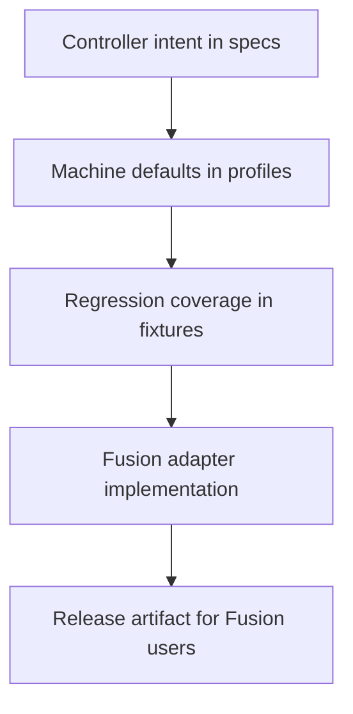
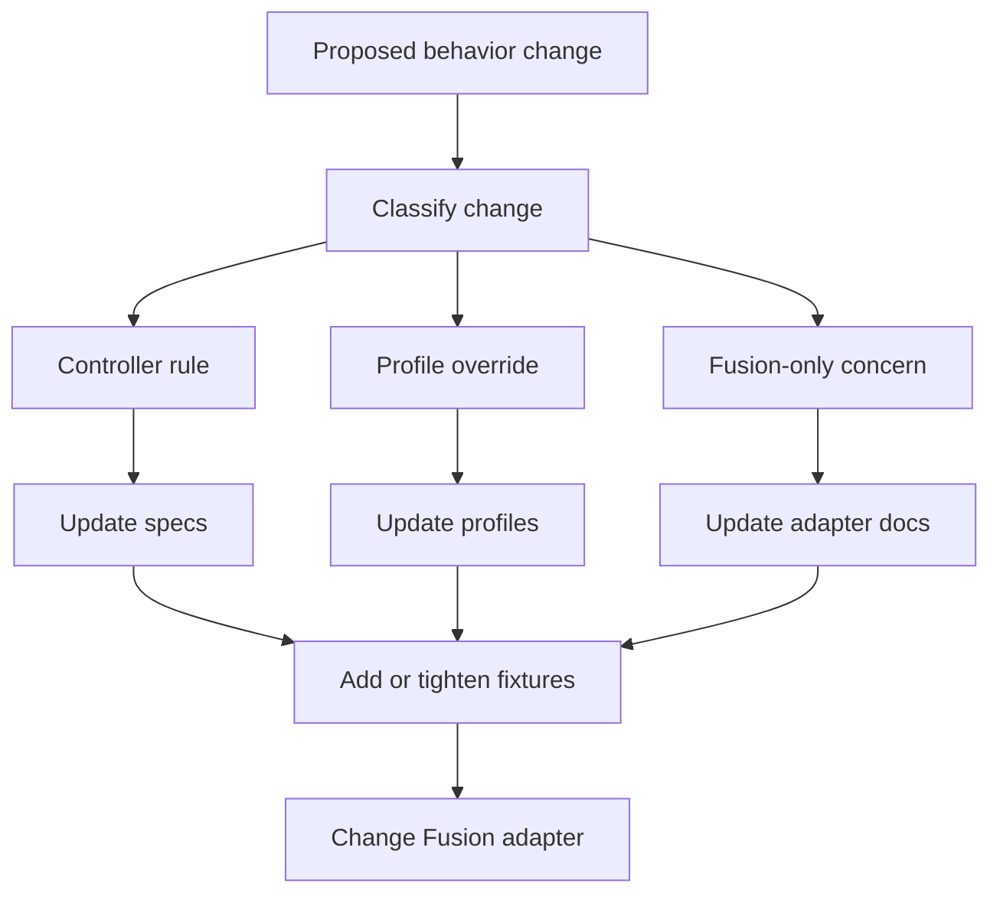

# Architecture

## Goal

Build a maintainable FluidNC post-processing project whose current product is a Fusion adapter, while keeping controller knowledge, machine profiles, and regressions understandable to contributors.

## Architectural stance

The repository is intentionally not centered on a generator.

Reasoning:

- there is only one real adapter target today
- generated post code is harder to debug than written post code
- most failures are behavioral and fixture-driven, not code-reuse failures
- a second adapter should be the trigger for shared generation logic, not a theoretical future

## Layers

### `specs/`

Neutral behavior contracts.

Examples:

- unit handling rules
- retract and safe-start semantics
- arc and segment filtering policy
- tool-change invariants
- modal-state expectations

### `profiles/`

Machine or shop-level configuration defaults.

Examples:

- manual tool change router
- air blast vs no coolant machine
- conservative vs aggressive segment filtering defaults

Profiles are committed when they represent reusable patterns. One-off shop settings stay in `profiles/local/`.

### `fixtures/`

Regression assets and expected behavior.

Each fixture case should answer:

- what toolpath scenario is being modeled
- which invariants it protects
- what output characteristics must not regress

### `adapters/fusion/`

Fusion-specific implementation, packaging, upstream notes, and scripts.

This layer translates repo intent into Fusion post behavior. It is allowed to contain Fusion-specific compromises, but those compromises should not silently redefine controller truth.

## Review flow

## Source-of-truth boundary

Use this decision rule:

- if it is true for FluidNC regardless of CAM system, it belongs in `specs/`
- if it is true for a particular machine or shop, it belongs in `profiles/`
- if it protects against regression, it belongs in `fixtures/`
- if it exists only because Fusion's post API requires it, it belongs in `adapters/fusion/`

## Override precedence

Behavior should resolve in this order:

1. `specs/controller/*`
2. adapter defaults
3. committed profile
4. local uncommitted override
5. runtime Fusion post properties

This keeps the base model coherent while still allowing machine-specific tuning.

## Change taxonomy

Every non-trivial behavior change should be classified as one of:

- controller rule
- machine/profile override
- Fusion adapter concern
- release/process concern

That classification should appear in PR descriptions and design notes.

## Decision gates for future abstraction

Do not build a generic source-to-post compiler unless at least two of these are true:

- there is a second real adapter target
- adapter logic is drifting in the same behavior area
- fixtures prove the same semantics need to be emitted in two backends
- shared data or transforms are becoming copy-paste liabilities

Until then, prefer small neutral data files and a readable Fusion adapter.
