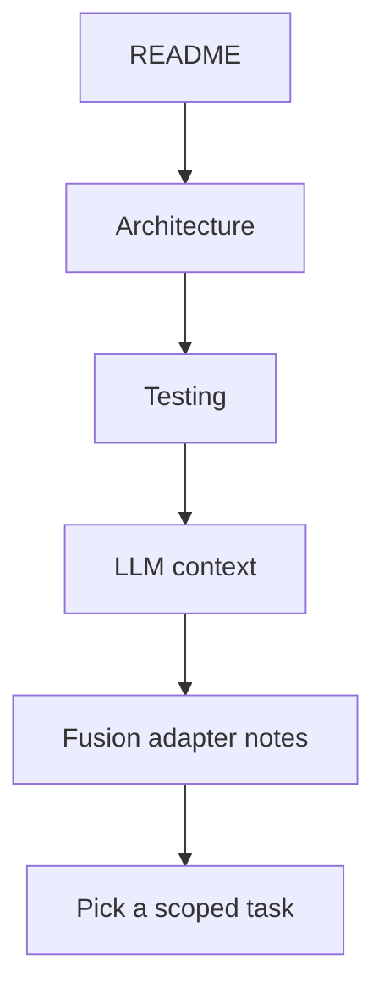

# Contributor Ramp-Up

## 30-minute path

1. Read `README.md`.
2. Read `docs/architecture.md`.
3. Read `docs/testing.md`.
4. Read `llm/README.md`.
5. Read `adapters/fusion/README.md`.

## Mental model

- `specs/` says what should be true
- `profiles/` says what defaults differ by machine or shop
- `fixtures/` says what must not regress
- `adapters/fusion/` says how Fusion emits the behavior

## First useful tasks for new contributors

- tighten a spec or invariant with missing detail
- add a fixture for a known failure mode
- document a profile and override pattern
- improve adapter comments around custom behavior tags

## Common mistakes to avoid

- putting controller truth directly into adapter comments only
- adding new runtime properties without documenting precedence
- solving a one-machine problem in global defaults
- adding abstraction before a second adapter exists
