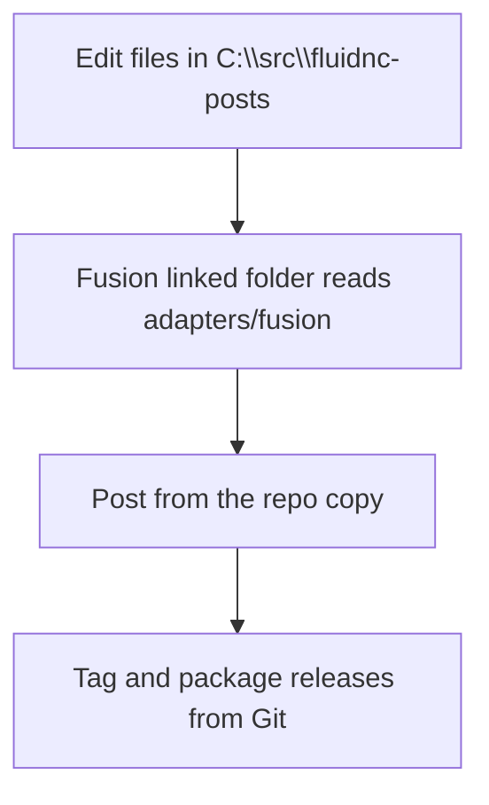

# Install In Fusion

## Recommended setup

Use a Linked Folder in Fusion and point it at:

`C:\src\fluidnc-posts\adapters\fusion`

That keeps the Git repo as the editable source while Fusion reads the same files directly.

## Workflow

1. Open Fusion Post Library.
2. Add a Linked Folder.
3. Select `C:\src\fluidnc-posts\adapters\fusion`.
4. Restart Fusion or refresh the Post Library if needed.
5. Edit only the files in the repo.

## Local install helper

If you want the repo copy to drive the existing local post path directly, use:

- [install-local-post.ps1](C:/src/fluidnc-posts/adapters/fusion/scripts/install-local-post.ps1)
- [status-local-post.ps1](C:/src/fluidnc-posts/adapters/fusion/scripts/status-local-post.ps1)

Recommended local workflow:

1. Prefer Fusion Linked Folder for normal development.
2. Use the install script when you want the repo adapter mirrored into the legacy local post path.
3. Use hard-link mode on the same drive when you want the repo file and local post path to stay in sync.

## Release flow

- development uses the Linked Folder
- releases are tagged in Git
- release artifacts package the Fusion adapter with version notes

Avoid treating Fusion Cloud storage as the source of truth. It is a deployment target at most.
