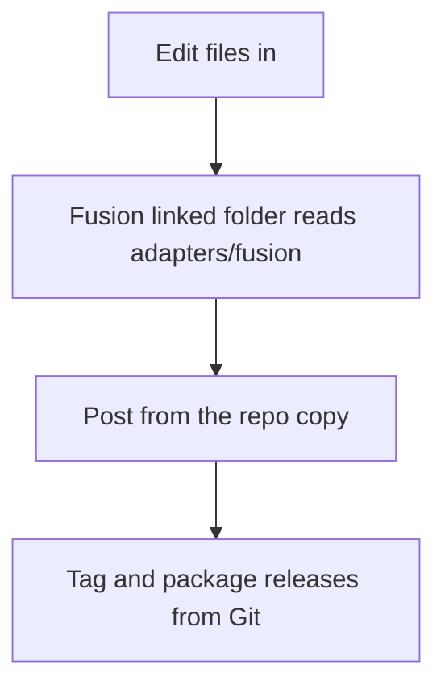

# Install In Fusion

## Recommended setup

Use a Linked Folder in Fusion and point it at:

`<repo-root>\adapters\fusion`



That keeps the Git repo as the editable source while Fusion reads the same files directly.

## Linked Folder Setup

These steps follow Autodesk's current Post Library flow for the Manufacture workspace: open the Post Library, then use the `Linked` library entry to point Fusion at a folder on disk that already contains `*.cps` files.

Windows steps:

1. Open Fusion and switch to the `Manufacture` workspace.
2. Open `Manage > Post Library`.
3. In the left panel, find the `Linked` library entry.
4. Right-click `Linked` and choose `Link folder`.
5. Select `C:\src\fluidnc-posts\adapters\fusion` and confirm.
6. In the center panel, verify that `FluidNC.cps` appears from that linked folder.
7. Close the Post Library.
8. Open the `Post Process` dialog for a setup or operation.
9. In the `Post` picker, select the post from the linked folder entry you just added.

Expected result:

- Fusion reads the repo copy directly from `C:\src\fluidnc-posts\adapters\fusion\FluidNC.cps`
- editing the repo file changes the post Fusion will use
- you do not need to copy the file into `AppData` for normal development

## Verify the linked setup

Use this checklist before manual fixture testing:

1. Re-open `Manage > Post Library`.
2. Select the linked folder entry in the left panel.
3. Confirm the center panel shows `FluidNC.cps` from `C:\src\fluidnc-posts\adapters\fusion`.
4. In the `Post Process` dialog, confirm the selected post comes from that linked entry, not from `My Posts > Local`.

If Fusion still shows an old local copy, remove that selection and re-pick the post from the linked folder list.

## Local install helper

If you want the repo copy to drive the existing local post path directly, use:

- [install-local-post.ps1](../adapters/fusion/scripts/install-local-post.ps1)
- [status-local-post.ps1](../adapters/fusion/scripts/status-local-post.ps1)

Recommended local workflow:

1. Prefer Fusion Linked Folder for normal development.
2. Use the install script when you want the repo adapter mirrored into the default local Fusion post path.
3. Use hard-link mode on the same drive when you want the repo file and local post path to stay in sync.

Examples:

```powershell
powershell -NoProfile -ExecutionPolicy Bypass -File .\adapters\fusion\scripts\status-local-post.ps1
```

```powershell
powershell -NoProfile -ExecutionPolicy Bypass -File .\adapters\fusion\scripts\install-local-post.ps1 -Mode HardLink
```

If you install to the local path, the default destination is:

`C:\Users\<you>\AppData\Roaming\Autodesk\Fusion 360 CAM\Posts\FluidNC.cps`

That path is useful for comparing the repo rewrite against an installed original post during regression work, but it is a separate workflow from the linked-folder setup above.

## Release flow

- development uses the Linked Folder
- releases are tagged in Git
- release artifacts package the Fusion adapter with version notes

Avoid treating Fusion Cloud storage as the source of truth. It is a deployment target at most.
