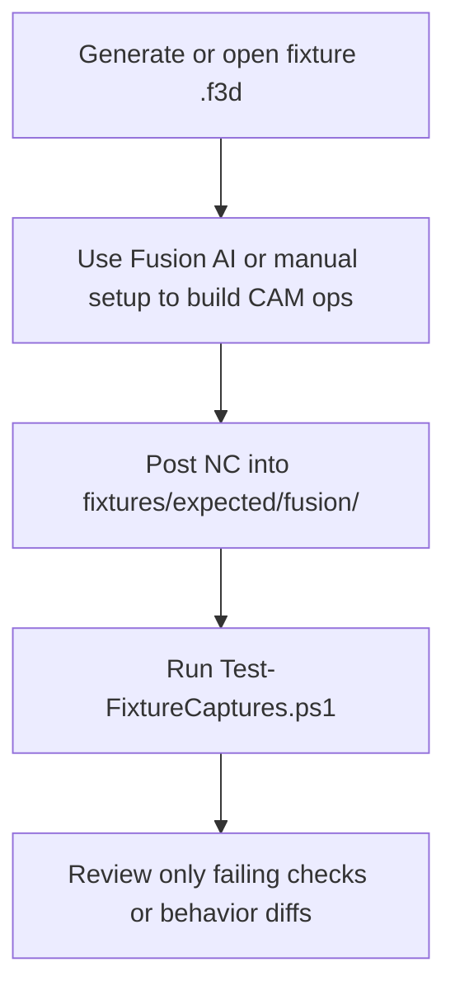
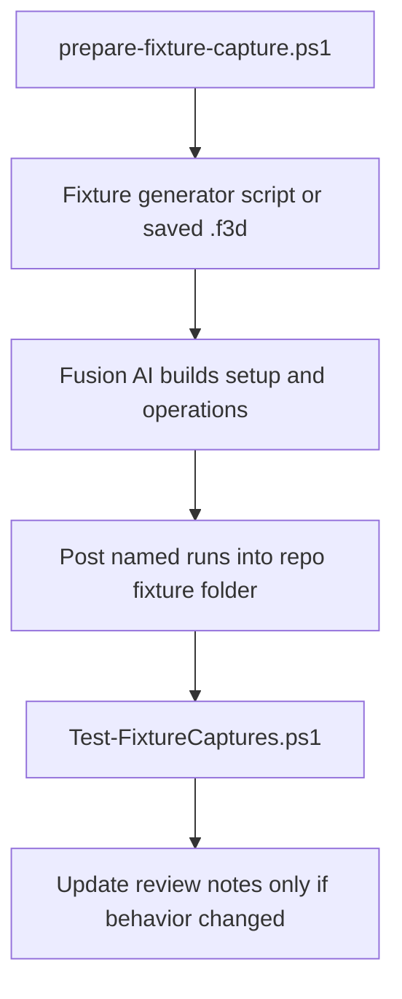

# Testing

## Test strategy

Use fixture-driven regression first.

The primary failure mode for post processors is not syntax. It is behavioral drift across real toolpath patterns and controller-sensitive edge cases.

## Required fixture families

- metric jobs
- inch jobs
- arc-heavy paths
- tiny linear segment storms
- drilling and dwell cases
- manual tool change sequences
- multi-tool jobs
- split-file jobs
- restart-mid-job safety cases
- coolant-disabled machines
- unmapped coolant warning cases
- extended work offset cases
- program-end park position cases

## Assertion layers

1. Snapshot checks for emitted NC where stable.
2. Mocked Fusion-host unit tests for adapter callbacks and helper branches.
3. Invariant checks for unit mode, safety lines, tool-change state, and endpoint reachability.
4. Human review for controller-specific tradeoffs and readability.

## Initial fixture priority

The first concrete fixture family for this repository is:

- `inch-job`
- `split-file`
- `multi-tool`
- `tiny-segment-storm`

These cases cover the highest-risk imported adapter behavior first: unit safety, restart safety, tool changes, and planner-aware segment filtering.

## Fixture authoring standard

Every non-trivial fixture should define:

- Fusion setup requirements
- exact post-run matrix with property values
- required captured artifacts
- manual review checkpoints
- forbidden output patterns
- failure impact in machine terms

At minimum, each fixture artifact set should include:

- the Fusion source or an exact reproduction note
- the emitted NC for every defined post run
- the exact post property values used
- a short review note tied to invariant pass or fail

## Regression discipline

- add a fixture before fixing a known bug when possible
- if exact snapshots are brittle, encode the expected invariant in fixture notes and tooling
- treat inch-mode regressions, restart regressions, and tool-change regressions as high severity

## Current captured baseline

The repository now has captured Fusion output for the first four high-value fixture families:

- `inch-job`
- `multi-tool`
- `tiny-segment-storm`
- `split-file`

These are stored under [fixtures/expected/fusion](../fixtures/expected/fusion) with:

- source `.f3d` when available
- emitted `*.nc`
- per-run `*.properties.txt`
- per-run `*.review.md`

## Next fixture priority

The next fixture families should close the remaining baseline 3-axis gaps before new multi-axis or probing work. The canonical list and delivery order is in the [Phase 5 Roadmap](phase-5-roadmap.md) (Slice A).

## Fast regression loop

Use the captured fixtures as the default regression path.

This is intentionally lighter than a full post automation harness.

Reasoning:

- Fusion posting is still interactive
- the highest-risk failures are already represented in captured artifacts
- a small invariant validator catches drift faster than re-reading NC by hand every time

## Agent-assisted regression split

When working with a coding agent, split the work at the Fusion boundary.

- Start by following [Install In Fusion](./install-fusion.md) and verify whether you are using a Fusion Linked Folder or a local installed post path.
- The user does the Fusion-only steps: open the fixture `.f3d`, select the post, set the run properties, and click `Post`.
- The agent does the local file work after each post: diff emitted NC against the captured baseline or original-post output, run `Test-FixtureCaptures.ps1`, inspect required checkpoints in the emitted text, and summarize only the remaining human-only concerns.
- Do not ask the user to manually diff files, count lines, grep for invariants, or read review sidecars when the agent can access the emitted files locally.
- When the agent asks for manual posting, it should include the concrete linked-folder or local-post setup steps instead of referring to them generically.
- If the capture should not overwrite the baseline yet, post into a scratch folder first and let the agent compare from there.

## Proven authoring workflow

The fastest workflow validated in this repo is:

1. Create the expected-output folder with `prepare-fixture-capture.ps1`.
2. Generate fixture geometry with a repo script when possible.
3. Let Fusion AI create the setup and operations from explicit instructions.
4. Post each defined run directly into the fixture folder.
5. Run `Test-FixtureCaptures.ps1`.
6. Let the agent review emitted NC and diffs when file paths are available locally.
7. Do human review only for controller-specific judgment, machine safety context, or Fusion actions the agent cannot perform.

## Community fixture contributions

Community fixture submissions should follow the same real-Fusion capture model used by maintainers.

Each contributed fixture family should include:

- the source `.f3d` when possible, otherwise an exact reproduction note
- emitted `*.nc` for every named post run
- matching `*.properties.txt` and `*.review.md`
- the selected machine profile id or a clear machine-context note
- required safety invariants and forbidden output patterns

The mocked-host harness remains mandatory for callback and state coverage, but it is not enough by itself for a new capability slice. New feature families still need real Fusion-posted evidence.

## Current validator scope

The lightweight validator in [Test-FixtureCaptures.ps1](../tools/validate/Test-FixtureCaptures.ps1) checks:

- `inch-job`: inch mode is preserved across section starts
- `multi-tool`: tool boundaries, spindle dwell, optional stop behavior, and coolant transitions
- `tiny-segment-storm`: monotonic line-count reduction and preserved section structure across filter settings
- `split-file`: emitted master/subfile trees and per-file startup safety

It is not a replacement for controller validation. It is the repo's first-pass guardrail against obvious regression in emitted NC.

The next validation additions are the fixture families listed in the [Phase 5 Roadmap](phase-5-roadmap.md) (Slice A).

## Automation

The repo supports one shared validation entry point for local work and CI:

- run `npm install` once per checkout
- run `npm run hooks:install` once per checkout to enable Git hooks
- `pre-commit` runs adapter syntax, lint, and 100% coverage-gated unit validation
- `pre-push` runs adapter validation plus `Test-FixtureCaptures.ps1`
- GitHub PR validation runs the same `npm run validate` command on `windows-latest`

CI is intentionally narrower than the full local/manual regression envelope:

- CI blocks on syntax, lint, fixture validators, and the mocked-host unit/differential harnesses that can run from repo-owned inputs alone.
- CI should not depend on a moving Autodesk-installed original post or a live Fusion session.
- Exact original-vs-rewrite differentials against the locally installed Autodesk post remain a local guardrail.
- Real Fusion posting against the captured fixture families remains the release-grade regression check.
- A capability slice is not done on mocked-host evidence alone.

## Mocked adapter coverage

`npm run test:unit` executes the Fusion adapter in a mocked host rather than inside Fusion itself.

This harness:

- loads `adapters/fusion/FluidNC.cps` in a VM-backed mock Fusion runtime
- exercises every function, branch, and line in the current adapter
- fails the build unless statements, branches, functions, and lines all remain at `100%`
- runs same-input differential scenarios against the local original `FluidNC.cps` when that file is available and fails on emitted NC or split-file tree drift

The repo post's helper surface is intentionally repo-owned. If you need to exercise the original Autodesk-derived post in the same mock harness, point the harness at that file through `loadPost({ cpsPath })` or the local-original validation tools rather than reintroducing legacy pass-through names into `FluidNC.cps`.

Use `npm run test:unit:plain` if you only want the Node test runner output without the explicit coverage summary.

## Original fixture audit

`npm run audit:fixtures:original` runs the local original Fusion post against the mocked host and compares the emitted text to the checked-in fixture captures.

Use this command to audit mock fidelity, not to replace real Fusion fixture posting.

The audit reports each mismatch as one of:

- exact match
- scenario depth gap: the current mock scenario stops before the full captured toolpath is replayed
- scenario metadata gap: the scenario properties or tool metadata do not yet match the captured run closely enough
- possible host gap: a mismatch that is not already explained by the current scenario limitations

This command is local-only because it depends on a pinned original `FluidNC.cps` installed on the machine.

## Controller preflight

Before real cutting, verify the controller-side settings that the post only echoes in comments:

- `junction_deviation_mm = 0.01`
- `arc_tolerance_mm = 0.002`

Exact NC diffs prove the post is emitting the expected header values. They do not prove the target FluidNC controller is configured the same way.

## Practical posting rules

- In Fusion, enter the base file name without `.nc`; Fusion appends the extension.
- Keep output paths inside the matching fixture folder so artifacts stay comparable.
- Treat `*.properties.txt` and `*.review.md` as required outputs, not optional notes.
- Ignore or delete stale `*.failed` artifacts from misnamed posts before validating if they become confusing.
- When using an agent, hand it the emitted file path or folder path immediately after posting so it can run the local comparison work.
