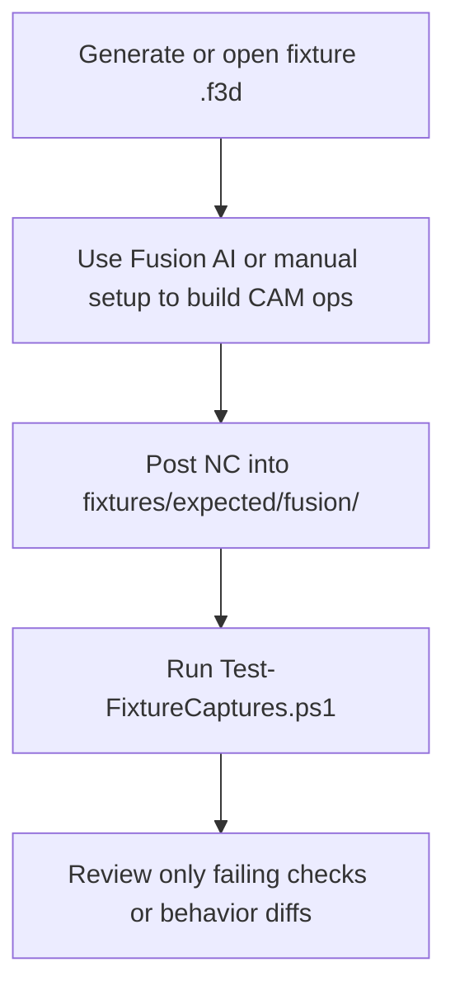
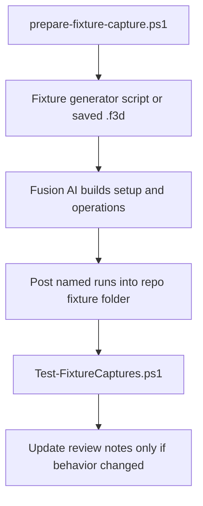

# Testing

## Test strategy

Use fixture-driven regression first.

The primary failure mode for post processors is not syntax. It is behavioral drift across real toolpath patterns and controller-sensitive edge cases.

## Required fixture families

- metric jobs
- inch jobs
- arc-heavy paths
- tiny linear segment storms
- drilling and dwell cases
- manual tool change sequences
- multi-tool jobs
- split-file jobs
- restart-mid-job safety cases
- coolant-disabled machines

## Assertion layers

1. Snapshot checks for emitted NC where stable.
2. Invariant checks for unit mode, safety lines, tool-change state, and endpoint reachability.
3. Human review for controller-specific tradeoffs and readability.

## Initial fixture priority

The first concrete fixture family for this repository is:

- `inch-job`
- `split-file`
- `multi-tool`
- `tiny-segment-storm`

These cases cover the highest-risk imported adapter behavior first: unit safety, restart safety, tool changes, and planner-aware segment filtering.

## Fixture authoring standard

Every non-trivial fixture should define:

- Fusion setup requirements
- exact post-run matrix with property values
- required captured artifacts
- manual review checkpoints
- forbidden output patterns
- failure impact in machine terms

At minimum, each fixture artifact set should include:

- the Fusion source or an exact reproduction note
- the emitted NC for every defined post run
- the exact post property values used
- a short review note tied to invariant pass or fail

## Regression discipline

- add a fixture before fixing a known bug when possible
- if exact snapshots are brittle, encode the expected invariant in fixture notes and tooling
- treat inch-mode regressions, restart regressions, and tool-change regressions as high severity

## Current captured baseline

The repository now has captured Fusion output for the first four high-value fixture families:

- `inch-job`
- `multi-tool`
- `tiny-segment-storm`
- `split-file`

These are stored under [fixtures/expected/fusion](C:/src/fluidnc-posts/fixtures/expected/fusion) with:

- source `.f3d` when available
- emitted `*.nc`
- per-run `*.properties.txt`
- per-run `*.review.md`

## Fast regression loop

Use the captured fixtures as the default regression path.

This is intentionally lighter than a full post automation harness.

Reasoning:

- Fusion posting is still interactive
- the highest-risk failures are already represented in captured artifacts
- a small invariant validator catches drift faster than re-reading NC by hand every time

## Proven authoring workflow

The fastest workflow validated in this repo is:

1. Create the expected-output folder with `prepare-fixture-capture.ps1`.
2. Generate fixture geometry with a repo script when possible.
3. Let Fusion AI create the setup and operations from explicit instructions.
4. Post each defined run directly into the fixture folder.
5. Run `Test-FixtureCaptures.ps1`.
6. Do manual NC review only for new behavior or failed checks.

## Current validator scope

The lightweight validator in [Test-FixtureCaptures.ps1](C:/src/fluidnc-posts/tools/validate/Test-FixtureCaptures.ps1) checks:

- `inch-job`: inch mode is preserved across section starts
- `multi-tool`: tool boundaries, spindle dwell, optional stop behavior, and coolant transitions
- `tiny-segment-storm`: monotonic line-count reduction and preserved section structure across filter settings
- `split-file`: emitted master/subfile trees and per-file startup safety

It is not a replacement for controller validation. It is the repo's first-pass guardrail against obvious regression in emitted NC.

## Practical posting rules

- In Fusion, enter the base file name without `.nc`; Fusion appends the extension.
- Keep output paths inside the matching fixture folder so artifacts stay comparable.
- Treat `*.properties.txt` and `*.review.md` as required outputs, not optional notes.
- Ignore or delete stale `*.failed` artifacts from misnamed posts before validating if they become confusing.
